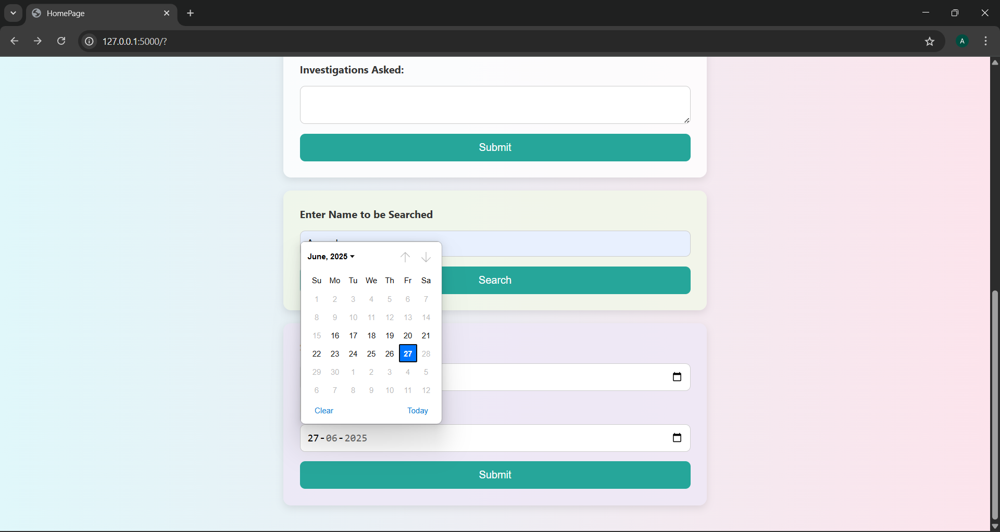

## 🩺 DocuMeds: A Patient Record Site

DocuMeds is a web application built using **Python Flask** that allows doctors to manage patient medical records efficiently.  
It collects key information like **name, age, sex, history, investigations, and medicines given
so that during future visits, doctors can quickly review the past treatment and make informed decisions. 
This helps save time and improves the quality of patient care.

---

## ✅ Features

- ➕ Add new patient record with name, age, sex, history, investigations, and medicines
- 📝 After adding a record, shows a success message and a button to return to homepage

- 🏠 Homepage options:
  - Add a new patient record
  - Search for an existing patient by name
  - View all records across patients within a specific date range

- 📅 Date validation:
  - Prevents end date from being earlier than start date
  - Disallows future dates (must be within the server's current date)

- 🧠 Auto-filled patient info (name, sex, age) when updating existing patient history

- 🧾 Multi-line input & display for:
  - Medical history
  - Investigations
  - Prescribed medicines

- 💾 Data is stored securely in a MySQL database (`projectdb1`), inside table `p1`

---

## ⚙️ Installation & Setup

Follow these steps to run the project on your local machine.

---

🔁 1. Clone the Repository

Terminal Command:
git clone https://github.com/aayushankush01/DocuMeds.git
cd DocuMeds

🐍 2. Create and Activate Virtual Environment
Command:
python -m venv myenv
myenv\Scripts\activate

📦 3. Install Required Dependencies
pip install -r requirements.txt

🛠️ 4. Set Up MySQL Database
Open MySQL Workbench or terminal, then run:

CREATE DATABASE projectdb1;

Switch to that database and run:

CREATE TABLE p1 (
    Sr_No INT PRIMARY KEY AUTO_INCREMENT,
    patientname VARCHAR(30),
    Sex VARCHAR(15),
    age INT,
    His VARCHAR(40),
    Date_Time TIMESTAMP DEFAULT CURRENT_TIMESTAMP,
    Inhouse_Medicine VARCHAR(100),
    Prescribed_Medicine VARCHAR(100),
    Investigations VARCHAR(100)
);
⚠️ Note: This table must be created manually before running Data_Base.py

🔐 5. Set MySQL Password
set MYSQL_PASSWORD=yourpassword

---

## 🧑‍⚕️ Usage

Once the app is running at `http://localhost:5000`, you'll be taken to the **homepage**, where you can:

---

🟢 1. Add a New Patient Record
- Enter the patient’s:
  - Name
  - Sex
  - Age
  - Medical History
  - Investigations
  - Medicines Given
- After submitting, a success message appears confirming the record was saved.
- You’ll be given the option to return to the homepage and add another.

---

🔍 2. Search for an Existing Patient
- In the Enter Name to be searched section.
- Enter the patient’s name.
- View a list of all previous records for that patient.
- Name, sex, and age are auto-filled when adding new records — but age can be updated.

---

## 📅 3. Search All Records by Date Range
- In the next section.
- Enter a start date and end date.
- Only valid date ranges are accepted:
  - End date cannot be before start date
  - No future dates allowed
- Results show all records from all patients between the selected dates.

---

🧾 4. Multi-line Entry Fields
- The fields for History, Investigations, and Medicines accept multi-line input.
- These are shown clearly in table format when reviewing data.

---

## 🖼️ Screenshots

### ➕ Add New Patient Form

---

### 🔍 Search by Patient Name

---

### 📅 Search by Date Range

 ## 💻 Tech Stack

This project uses the following technologies and Python packages:

| Technology / Library         | Purpose                                                   |
|------------------------------|-----------------------------------------------------------|
| **Python 3.x**               | Core programming language                                 |
| **Flask 3.1.1**              | Lightweight web framework for routing and server logic    |
| **Jinja2 3.1.6**             | HTML templating engine integrated with Flask              |
| **Werkzeug 3.1.3**           | WSGI utility for Flask server functionality               |
| **MySQL**                    | Relational database for storing patient records           |
| **mysql-connector-python 9.3.0** | Python driver to connect Flask with MySQL            |
| **Click 8.2.1**              | CLI command support in Flask                              |
| **Blinker 1.9.0**            | Signal support used by Flask internally                   |
| **ItsDangerous 2.2.0**       | Secure session and token signing (used by Flask)          |
| **MarkupSafe 3.0.2**         | Safe string rendering in Jinja templates                  |
| **HTML/CSS**                 | Frontend page layout and styling                          |
| **Git & GitHub**             | Version control and project hosting                       |

---

## 🙋‍♂️ Author

- **Name**: Aayush Ankush  
- **GitHub**: [@aayushankush01](https://github.com/aayushankush01)  
- **Project**: [DocuMeds – A Patient Record System](https://github.com/aayushankush01/DocuMeds)

---
